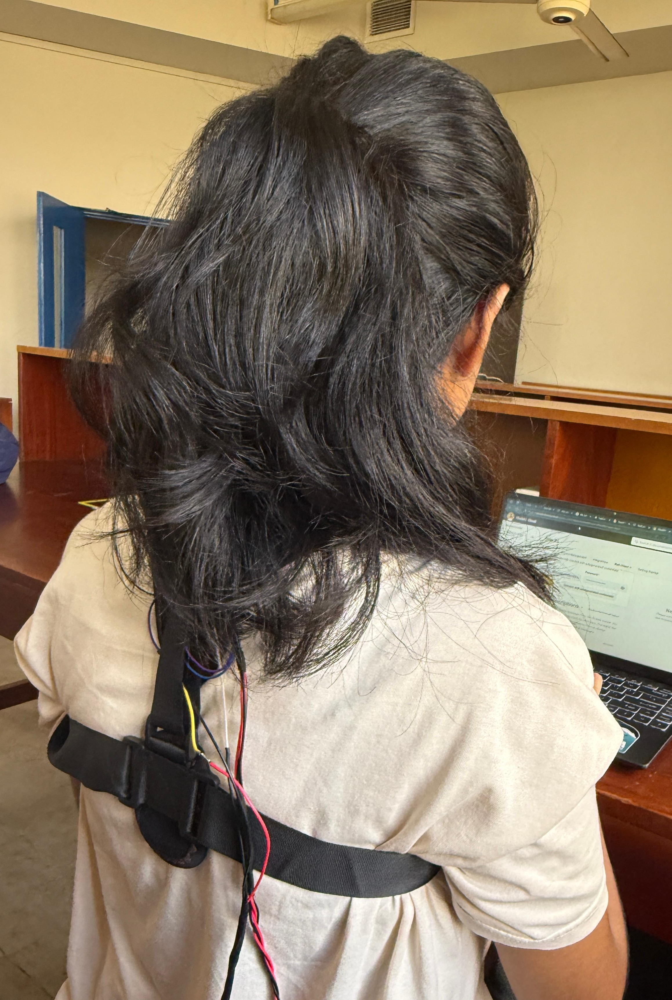

# Posture Guard

*Figure – Posture Guard wearable device*

## 📌 Overview
Posture Guard is a wearable posture correction device powered by an **ESP32** microcontroller. It uses an **IMU sensor** to detect slouching and a **vibration motor** to provide gentle feedback, helping you maintain a healthy sitting position throughout the day.

## ✨ Features
- Real-time slouch detection using an IMU sensor
- Gentle vibration alerts when poor posture is detected
- Wireless connectivity via ESP32 (Wi-Fi/Bluetooth)
- Rechargeable battery for all-day use
- Lightweight and comfortable design

## 🛠 How It Works
1. The IMU sensor continuously measures your upper body angle.
2. The ESP32 processes this data to determine posture quality.
3. If slouching exceeds the set threshold, the vibration motor is activated.
4. Anotification is sent to the mobile phone via the app.

## 📷 Pictures

| Device Front | Inside View | Wearing Example |
|--------------|-------------|-----------------|
|  |  |  |

## 📦 Components Used
- **ESP32** microcontroller
- **IMU Sensor** (e.g., MPU-6050 / MPU-9250)
- **Vibration Motor**
- Li-ion Battery & Charging Circuit
- Enclosure (3D printed or custom case)

